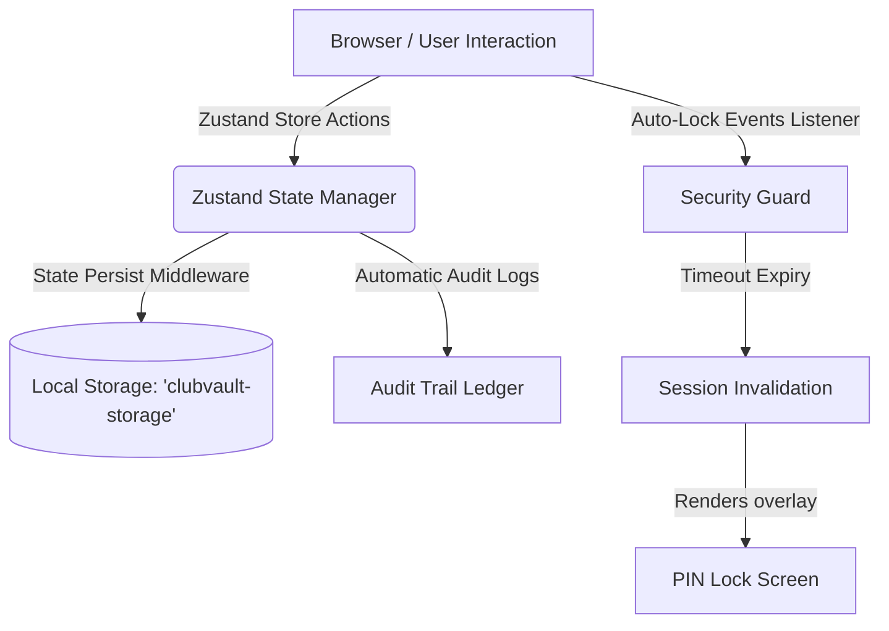

# ClubVault 🪙

**ClubVault** is a secure, state-of-the-art financial ledger and dashboard application designed specifically for clubs, societies, and small community groups. It provides treasurers and members with a premium, transparent, and beautiful interface to manage finances, track transactions, upload digital receipts, and maintain meeting notes with military-grade local security.

Designed with a sleek **Glassmorphism UI/UX**, it supports **Dark Mode**, **Light Mode**, and matches system preferences seamlessly.

---

## Key Features

### 🛡️ Local Vault Security
- **PIN-Protected Entry**: Restrict unauthorized local access to sensitive financial records with a 4-digit passcode check on startup and refresh.
- **Inactivity Auto-Lock**: Automatically lock the vault after a configurable period of inactive user interaction (1, 5, 10, or 30 minutes).
- **Brute-Force Protection**: Enforces rate-limiting on entry attempts, temporarily locking access for 5 minutes after 3 consecutive failed PIN attempts.

### 📊 Cash Flow & Financial Analytics
- **Dynamic Dashboard**: Monitor total balance, Year-to-Date (YTD) income/expense summaries, recent actions, and key growth indicators at a glance.
- **Interactive Recharts**: 
  - *Expenses by Category*: Donut charts highlighting percentage breakdown of spends.
  - *Monthly Cash Flow*: Side-by-side bar charts illustrating Monthly Income vs. Expenses.
  - *Weekly Cash Trend*: Beautiful glowing Area Charts showing the rolling balance over the last 4 weeks.

### 📝 Treasurer Tools
- **Transaction Manager**: Full CRUD support for adding, editing, and deleting transactions with details like description, amount, date, and category.
- **Digital Receipts**: Drag-and-drop or file upload support for physical receipts, converting them to compressed Base64 Data URLs stored securely in your browser's LocalStorage.
- **Autosaved Meeting Notes**: Real-time rich text notebook for recording financial annotations or meeting minutes. **Safely autosaves even if you navigate pages mid-typing.**
- **Automatic Audit Trail**: Tracks and logs all modifications (added transactions, edits, deletions, settings adjustments) chronologically to ensure governance and fraud prevention.

---

## Tech Stack

- **Framework**: [React 19](https://react.dev/) + [Vite](https://vitejs.dev/) + [TypeScript](https://www.typescriptlang.org/)
- **Styling**: [Tailwind CSS v4](https://tailwindcss.com/) (modern variables-based configuration)
- **State Management**: [Zustand](https://github.com/pmndrs/zustand) with local storage state persistence
- **Charts**: [Recharts v3](https://recharts.org/)
- **Icons**: [Lucide React](https://lucide.dev/)
- **Date Formatting**: [date-fns](https://date-fns.org/)

---

## Quick Start

### 1. Prerequisites
Make sure you have [Node.js](https://nodejs.org/) (v18+) and [npm](https://www.npmjs.com/) installed.

### 2. Installation
Clone the repository and install dependencies:

```bash
git clone https://github.com/petero-codes/finnanceclub.git
cd finnanceclub
npm install
```

### 3. Run Development Server
Start the local server to run the application:

```bash
npm run dev
```

The application will launch locally at: **[http://localhost:5173](http://localhost:5173)**

### 4. Build Production Bundle
To build the optimized production assets:

```bash
npm run build
npm run preview
```

---

## Architecture & Data Flow



### Data Persistence
To respect user privacy and avoid costly database infrastructure, **ClubVault** runs **100% locally and serverless**. 
- All transactions, receipts, audit trails, and settings are serialized into a single persisted key in the browser's storage (`clubvault-storage`).
- **Data Portability**: Users can export their entire database state to a single `.json` file via the settings page, and import backups to restore states on separate devices.

---

## Security Best Practices Observed
1. **Zero Server Footprint**: No financial data ever leaves the user's browser, preventing server leaks and cloud database hacking.
2. **HTML Sanitization**: All user-provided text inputs (Notes, Descriptions, Club Names) are automatically sanitized on submission to block Cross-Site Scripting (XSS) injection attacks.
3. **Privacy-Preserving Commits**: Git email configurations utilize GitHub's secure, anonymized `noreply` routing, shielding the developer's personal email address from public scraping.

---

## License
Licensed under the [MIT License](LICENSE).
